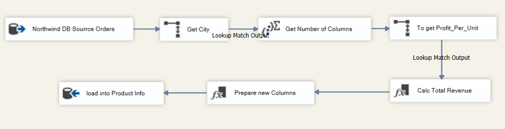
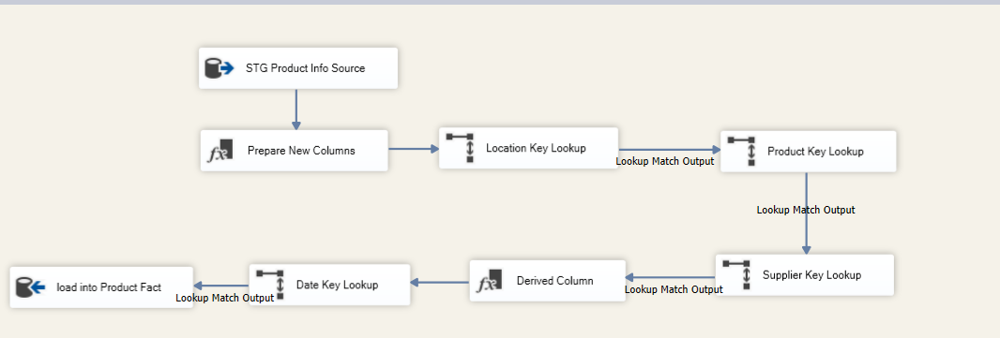
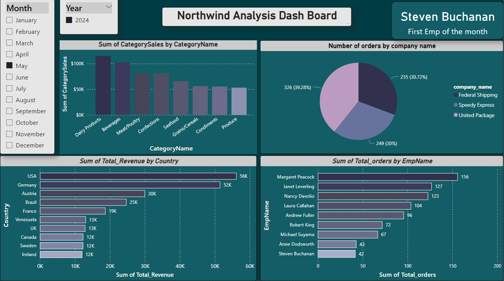

# Datawarehouse_Project ✨📊
<!DOCTYPE html>
<html lang="en">
<head>
  <meta charset="UTF-8">
  <meta name="viewport" content="width=device-width, initial-scale=1.0">
</head>
<body>
  

    <h1>Table of Contents</h1>
    <ul>
      <li><a href="#northwind-schema">Northwind Database Schema</a></li>
      <li><a href="#KPIs">KPIs</a></li>
      <li><a href="#data-warehouse-design">Data Warehouse Design</a></li>
      <li><a href="#etl-process">ETL Process</a></li>
      <li><a href="#deploy and schedule">Deploying and Scheduling</a></li>
      <li><a href="#analytical-queries">Analytical Queries</a></li>
      <li><a href="#interactive-dashboard">Interactive Dashboard Uisng Power BI</a></li>
    </ul>
    <h2 id="northwind-schema">Northwind Database Schema</h2>
   
The Northwind database is a classic and fictional relational database that simulates the operations of a small trading company called Northwind Traders. The database is structured into several tables representing entities such as products, customers, orders, employees, suppliers, and categories. Each table contains attributes relevant to its respective entity, facilitating the storage and management of data related to the company's transactions, inventory, personnel, and interactions with customers and suppliers.

    <h3>Main Tables</h3>
    <ul>
      <li><strong>Products:</strong> Stores information about the products offered by Northwind Traders.</li>
      <li><strong>Customers:</strong> Maintains the details of the customers who place orders.</li>
      <li><strong>Orders:</strong> Captures the order details, including the customer, order date, and shipping information.</li>
      <li><strong>Order Details:</strong> Stores the individual line items for each order, including the product, quantity, and unit price.</li>
      <li><strong>Employees:</strong> Holds the data about the company's employees, such as their names, job titles, and reporting structure.</li>
      <li><strong>Suppliers:</strong> Keeps track of the suppliers who provide products to Northwind Traders.</li>
      <li><strong>Categories:</strong> Organizes the products into different categories.</li>
    </ul>
    <h3>Database Schema</h3>
    
    <h2 id="KPIs">KPIs</h2>
    
The following table outlines a set of essential KPIs relevant to our project

    <table>
      <tr>
        <th>KPI</th>
        <th>Definition</th>
      </tr>
      <tr>
        <td>Total Orders Handled</td>
        <td>The aggregate count of orders managed and fulfilled by shippers, indicating operational throughput and workload distribution efficiency.</td>
      </tr>
      <tr>
        <td>Average Shipment Time</td>
        <td>The mean duration taken by each shipper to complete order deliveries, reflecting the speed and reliability of shipping services provided.</td>
      </tr>
      <tr>
        <td>Average Shipment Cost</td>
        <td>The average expense incurred per shipment by individual shippers, serving as a key metric for evaluating shipping cost effectiveness and operational expenditure management.</td>
      </tr>
      <tr>
        <td>Total Units Sold</td>
        <td>The cumulative quantity of units sold across all product offerings, indicating sales volume and market demand for each product.</td>
      </tr>
      <tr>
        <td>Total Revenue</td>
        <td>The aggregated revenue generated from the sale of all products, serving as a primary indicator of sales performance and revenue generation capability.</td>
      </tr>
      <tr>
        <td>Revenue per Unit</td>
        <td>The average revenue generated per unit sold for each product, providing insights into pricing strategies, product profitability, and customer purchasing behavior.</td>
      </tr>
      <tr>
        <td>Total Number of Orders</td>
        <td>The overall count of orders placed by customers, representing sales activity levels and customer engagement with the business.</td>
      </tr>
      <tr>
        <td>Total Sales Revenue</td>
        <td>The total monetary value generated from all sales transactions, serving as a key financial metric for assessing business performance and revenue growth.</td>
      </tr>
      <tr>
        <td>Average Order Value</td>
        <td>The mean monetary value of individual orders placed by customers, providing insights into customer spending patterns and purchase behavior, and informing marketing and sales strategies.</td>
      </tr>
    </table>
    <h2 id="data-warehouse-design">Data Warehouse Design</h2>
    <h4>Data Staging Area</h4>
    
The data staging area plays a pivotal role in the construction of the data warehouse. It serves as an intermediary step where data is collected, transformed, and prepared for integration into the warehouse.

    <ul>
      <li><strong>Data Extraction:</strong> Relevant data is extracted from source systems, such as the Northwind database.</li>
      <li><strong>Data Transformation:</strong> Data undergoes transformations to standardize formats, handle null values, and perform other necessary modifications.</li>
      <li><strong>Data Loading:</strong> Transformed data is loaded into staging tables within the data warehouse, ensuring cleanliness and consistency for downstream processing.</li>
    </ul>
    <h4>Data Warehouse Construction</h4>
    <h5>Facts</h5>
    <table>
      <tr>
        <th>Fact Table</th>
        <th>Description</th>
      </tr>
      <tr>
        <td>F_Shipper</td>
        <td>Captures shipping-related metrics such as the number of orders handled, average shipment time, and average shipment cost.</td>
      </tr>
      <tr>
        <td>F_Product</td>
        <td>Stores data on product sales, including the number of sold items, total revenue, and supplier information.</td>
      </tr>
      <tr>
        <td>F_Sales</td>
        <td>Tracks sales transactions made by employees, including the number of orders served and total revenue generated.</td>
      </tr>
    </table>
    <h5>Dimensions</h5>
    <table>
      <tr>
        <th>Dimension Table</th>
        <th>Description</th>
      </tr>
      <tr>
        <td>D_Date</td>
        <td>Contains date-related attributes for time-based analysis.</td>
      </tr>
      <tr>
        <td>D_Location</td>
        <td>Stores location information for customers, suppliers, and shipping destinations.</td>
      </tr>
      <tr>
        <td>D_Customer</td>
        <td>Holds details about customers, such as name, location, and segment.</td>
      </tr>
      <tr>
        <td>D_Employee</td>
        <td>Stores information about employees, including their names and job titles.</td>
      </tr>
      <tr>
        <td>D_Supplier</td>
        <td>Contains details about suppliers, such as name and location.</td>
      </tr>
      <tr>
        <td>D_Product</td>
        <td>Stores information about products, including category, supplier, and unit price.</td>
      </tr>
      <tr>
        <td>D_Shipper</td>
        <td>Contains details about shipping companies, such as name and location.</td>
      </tr>
    </table>
    <h4>Datawarehouse Schema</h4>
    
    <h2 id="etl-process">ETL Process</h2>
      
In this project, I utilized SQL Server Integration Services (SSIS) to design and implement a robust ETL process for populating a data warehouse, seamlessly integrating diverse data sources. To optimize the ETL, I implemented an incremental load strategy, enabling real-time data integration and analysis. The data warehouse schema supported comprehensive analysis, with fact tables capturing key business metrics complemented by dimension tables providing essential context. By leveraging SSIS and incremental loading, I delivered a solution that empowers stakeholders with timely and accurate insights to drive informed decisions.

    
This is a screenshot of the ETL Process for Product Fact Table loading 

        
        
        
    
 To see other packages download folder SSIS and enjoy :) 

    <h2 id="deploy and schedule">Deploying and Scheduling</h2>
    
In the deployment and scheduling phase, the SSIS catalog facilitated the organization and deployment of SSIS projects, packages, and environments. SQL Server Agent jobs were utilized to automate the execution of SSIS packages, enabling efficient ETL workflows. Each job executed specific SSIS packages responsible for loading dimension and fact tables. By defining job schedules and dependencies, ETL processes ran reliably according to business requirements. The centralized approach streamlined management and integration with other SQL Server components. This framework provided a robust foundation for automating and managing ETL processes, facilitating informed decision-making and driving business outcomes.

    <h2 id="analytical-queries">Analytical Queries</h2>
    <ul>
    <li><strong>Query 1:</strong> Identifies the fastest shipper for each country based on average shipment time during the specified period.</li>
    <li><strong>Query 2:</strong> Finds the top supplier in terms of revenue for each country during the specified period.</li>
    <li><strong>Query 3:</strong> Calculates the total number of units sold by each supplier during the specified period.</li>
    <li><strong>Query 4:</strong> Calculates the average shipment cost for each country.</li>
    <li><strong>Query 5:</strong> Calculates the total number of orders handled by each employee during the specified period.</li>
    <li><strong>Query 6:</strong> Calculates the total number of orders processed by each shipper during the specified period.</li>
    <li><strong>Query 7:</strong> Calculates the total revenue generated by each country during the specified period.</li>
  </ul>
    <h2 id="interactive-dashboard">Interactive Dashboard Using Power BI</h2>
    <ul>
  <li><strong>Category Sales Analysis:</strong> This section displays the total sales revenue for different product categories, providing insights into the best-selling and underperforming product lines.</li>
  <li><strong>Customer Order Distribution:</strong> Here, the distribution of orders among major customers is visualized through a pie chart, highlighting the top contributors to the company's revenue.</li>
  <li><strong>Global Revenue Overview:</strong> This section presents the total revenue generated from different countries, offering insights into the company's global reach and performance.</li>
  <li><strong>Employee Performance:</strong> Employee productivity and performance are showcased here, listing the top employees by the number of orders processed.</li>
</ul>
  

  
</body>
</html>
